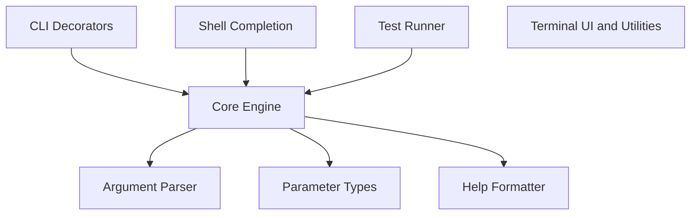

# Composable toolkit for creating command-line interfaces in Python with minimal code and sensible defaults.

**Stack:** Python

## Architecture

## How it works

*A user executes a CLI command with options and positional arguments from the command line.*

**1. CLI Decorators** — `src/click/decorators.py`

The user defines a Python command function annotated with decorators like command and option. These decorators wrap the underlying callback function into a Command object populated with Option metadata.

**2. Core Engine** — `src/click/core.py`

The entry script calls the command object, which instantiates an execution Context for the run. This context manages raw argument lists, flag parsing state, and parent-child command relationships.

**3. Argument Parser** — `src/click/parser.py`

The command delegates raw command-line string tokens to OptionParser for structure extraction. The parser organizes short flags, long options, and positional arguments into key-value maps.

**4. Parameter Types** — `src/click/types.py`

The core engine passes each parsed string token to its corresponding ParamType instance. The type validator converts the raw string into Python objects like integers, booleans, or file paths.

**5. Core Engine** — `src/click/core.py`

The context binds converted values to keyword arguments and invokes the original user function callback. It intercepts raised Exit or ClickException instances to exit gracefully with an appropriate status code.

**6. Terminal UI & Utilities** — `src/click/termui.py`

The executing callback prints styled output or prompts the user for input using terminal UI helpers. These helpers resolve cross-platform stream incompatibilities and apply ANSI color formatting.

## Start here

1. `src/click/core.py`
2. `src/click/decorators.py`
3. `src/click/parser.py`

## Gotchas

- Context objects form a linked parent-child hierarchy during nested group execution, allowing settings and parameters to cascade dynamically down the command tree.
- Click replaces standard system streams with custom wrappers in _compat.py and _winconsole.py to guarantee unicode and ANSI display support on Windows.
- Control flow relies heavily on internal exceptions like Abort, Exit, and BadParameter to handle terminal control and error reporting cleanly.