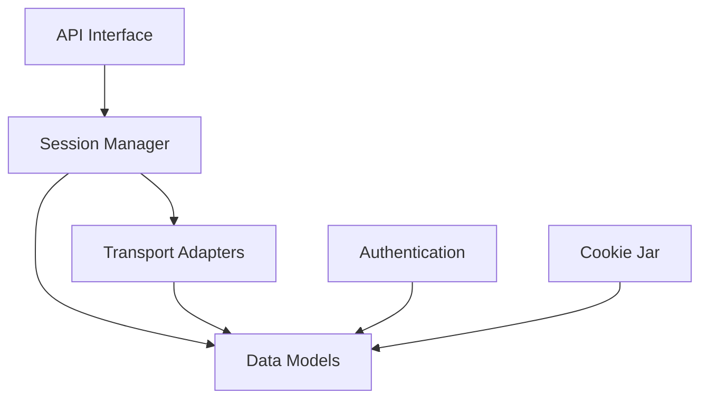

# Provides a user-friendly, high-level HTTP client library for Python applications.

**Stack:** Python, urllib3, certifi, charset_normalizer, idna, pytest

## Architecture

## How it works

*A user sends an authenticated HTTP GET request using requests.get with basic authentication.*

**1. API Interface** — `src/requests/api.py`

The user invokes requests.get which creates an ad-hoc Session instance. It immediately delegates the HTTP method and parameters to Session.request.

**2. Session Manager** — `src/requests/sessions.py`

The session creates an unprepared Request object with the target URL and credentials. It then passes this object through prepare_request to produce a PreparedRequest.

**3. Data Models** — `src/requests/models.py`

The Request object normalizes headers, body parameters, and URL parameters into a PreparedRequest. During preparation, it delegates credential formatting and cookie assembly to auth and cookie components.

**4. Authentication** — `src/requests/auth.py`

The HTTPBasicAuth handler intercepts the PreparedRequest to encode the username and password into base64. It attaches the formatted Authorization header directly onto the PreparedRequest.

**5. Cookie Jar** — `src/requests/cookies.py`

The session's cookie jar searches stored cookies for matching domain and path entries. It formats matching cookies into the Cookie header and attaches them to the PreparedRequest.

**6. Transport Adapters** — `src/requests/adapters.py`

The session locates the HTTPAdapter registered for the URL scheme and calls adapter.send. The adapter manages urllib3 connection pools, sends the request over the socket, and wraps the raw response.

**7. Data Models** — `src/requests/models.py`

The adapter constructs a high-level Response object, attaching the raw connection stream and headers. The session updates its cookie jar with any Set-Cookie headers received before returning the Response to the user.

## Start here

1. `src/requests/api.py`
2. `src/requests/sessions.py`
3. `src/requests/models.py`

## Gotchas

- Convenience functions like requests.get() instantiate and discard a new Session object for every single invocation, preventing connection reuse.
- PreparedRequest objects are mutated in place during the preparation process rather than returning fresh immutable instances.
- Transport adapters handle connection retries internally via urllib3, which transforms native socket errors into Requests exception types.